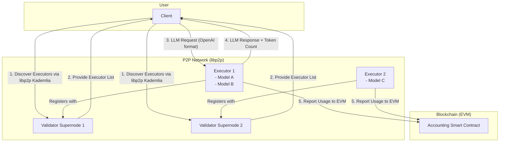
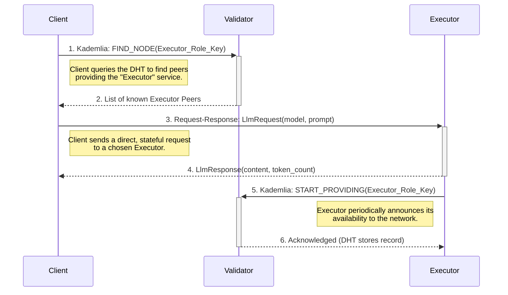

# Comprehensive Implementation Plan for the Decentralized LLM P2P Network

**Version: 1.0**

This document provides a complete and detailed architectural plan for a decentralized peer-to-peer network that facilitates LLM requests. It includes specifications for identity management, network protocols, role-specific logic, and blockchain-based accounting for usage. This document is intended to be the primary reference for the implementation phase.

## 1. High-Level Architecture

The system is composed of three distinct roles operating on a `libp2p` network, with an EVM smart contract serving as an immutable ledger for accounting.



---

## 2. Detailed Implementation Steps

### Step 1: Project Scaffolding & Core Dependencies

**Objective**: Establish a robust and modular project structure using a Cargo workspace.

**Project Structure**: A monorepo containing a shared `core` library and separate binary crates for each role.

```
lloom/
├── Cargo.toml                # Workspace definition
├── crates/
│   ├── lloom-core/          # Shared logic (identity, networking)
│   │   ├── src/
│   │   └── Cargo.toml
│   ├── lloom-client/        # Binary for the Client role
│   │   ├── src/
│   │   └── Cargo.toml
│   ├── lloom-executor/      # Binary for the Executor role
│   │   ├── src/
│   │   └── Cargo.toml
│   └── lloom-validator/    # Binary for the Validator role
│       ├── src/
│       └── Cargo.toml
├── contracts/                  # Solidity smart contracts
│   └── Accounting.sol
└── scripts/                    # Helper scripts (deployment, testing)
```

**Workspace `Cargo.toml`**:
```toml
[workspace]
members = [
    "crates/lloom-core",
    "crates/lloom-client",
    "crates/lloom-executor",
    "crates/lloom-validator",
]
resolver = "2"
```

**Core Dependencies (`crates/lloom-core/Cargo.toml`)**:
```toml
[dependencies]
libp2p = { version = "0.53", features = ["tokio", "gossipsub", "mdns", "kad", "request-response", "noise", "yamux", "tcp"] }
tokio = { version = "1", features = ["full"] }
alloy = { git = "https://github.com/alloy-rs/alloy", features = ["full"] }
serde = { version = "1.0", features = ["derive"] }
anyhow = "1.0"
tracing = "0.1"
```

**Binary Dependencies (e.g., `crates/lloom-client/Cargo.toml`)**:
```toml
[dependencies]
lloom-core = { path = "../lloom-core" }
tokio = { version = "1", features = ["full"] }
clap = { version = "4.4", features = ["derive"] }
tracing-subscriber = "0.3"
# ... other dependencies
```

### Step 2: Identity Management with `alloy.rs`

**Objective**: Create a unified cryptographic identity from a single private key for both network and on-chain operations.

**Detailed Logic (`lloom-core/src/identity.rs`)**:
The `Identity` struct will be the cornerstone of a node's existence. The `libp2p::identity::Keypair` will be created by converting the raw bytes of the `alloy::Wallet`'s `secp256k1` key. This is possible because both systems use the same underlying cryptography.

```rust
use alloy_primitives::Address;
use alloy_signer::{LocalWallet, Signer};
use libp2p::identity::{Keypair, PeerId};
use anyhow::Result;

pub struct Identity {
    /// The wallet containing the secp256k1 private key.
    pub wallet: LocalWallet,
    /// The libp2p keypair, derived from the wallet's private key.
    pub p2p_keypair: Keypair,
    /// The libp2p PeerId, derived from the p2p_keypair's public key.
    pub peer_id: PeerId,
    /// The EVM-compatible address, derived from the wallet's public key.
    pub evm_address: Address,
}

impl Identity {
    /// Creates a new identity from a wallet.
    pub fn new(wallet: LocalWallet) -> Result<Self> {
        let p2p_keypair = Keypair::from_protobuf_encoding(
            &wallet.to_protobuf_encoding()?
        )?;
        let peer_id = p2p_keypair.public().to_peer_id();
        let evm_address = wallet.address();

        Ok(Self { wallet, p2p_keypair, peer_id, evm_address })
    }

    /// Generates a completely new, random identity.
    pub fn generate() -> Self {
        let wallet = LocalWallet::new(&mut rand::thread_rng());
        Self::new(wallet).expect("Failed to create identity from new wallet")
    }

    /// Loads an identity from a hex-encoded private key string.
    pub fn from_str(private_key: &str) -> Result<Self> {
        let wallet: LocalWallet = private_key.parse()?;
        Self::new(wallet)
    }
}
```

### Step 3: `libp2p` Network Foundation

**Objective**: Define a reusable, composite `NetworkBehaviour` that encapsulates all necessary P2P protocols.

**Detailed Logic (`lloom-core/src/network.rs`)**:
This struct combines protocols for discovery (`kademlia`), pub/sub messaging (`gossipsub`), and direct, stateful communication (`request_response`).

```rust
use libp2p::{gossipsub, kad, request_response, swarm::NetworkBehaviour};
use serde::{Deserialize, Serialize};

// The request sent from a Client to an Executor
#[derive(Serialize, Deserialize, Debug, Clone)]
pub struct LlmRequest {
    pub model: String,
    pub prompt: String,
    // Could include other OpenAI-compatible fields later
}

// The response sent from an Executor to a Client
#[derive(Serialize, Deserialize, Debug, Clone)]
pub struct LlmResponse {
    pub content: String,
    pub token_count: u32,
}

// The custom event type that the behaviour will emit to the Swarm owner.
#[derive(Debug)]
pub enum LloomEvent {
    RequestResponse(request_response::Event<LlmRequest, LlmResponse>),
    Kademlia(kad::Event),
    Gossipsub(gossipsub::Event),
}

// Implement From<T> for LloomEvent for each inner event type.
// ...

// The main network behaviour struct
#[derive(NetworkBehaviour)]
#[behaviour(out_event = "LloomEvent")]
pub struct LloomBehaviour {
    /// Kademlia DHT for peer discovery.
    pub kademlia: kad::Behaviour<kad::store::MemoryStore>,
    /// Gossipsub for broadcasting information.
    pub gossipsub: gossipsub::Behaviour,
    /// A custom request-response protocol for direct LLM queries.
    pub request_response: request_response::Behaviour<
        request_response::cbor::Behaviour<LlmRequest, LlmResponse>
    >,
}
```

### Step 4: Role-Specific Network Protocols

**Objective**: Define the precise application-level logic and interaction patterns for each role.

**Interaction Sequence Diagram**:


*   **Validator Logic**:
    *   **Role**: Network bootstrap and discovery anchor.
    *   **Action**: Runs a `libp2p` Swarm in listening mode. Its Kademlia instance is configured in server mode. It performs no application logic; it simply exists to keep the DHT healthy and answer queries, which `libp2p` handles automatically.
*   **Executor Logic**:
    *   **Role**: Service provider.
    *   **Action**: Connects to Validators to join the network. Periodically calls `kademlia.start_providing()` with a predefined key representing the "Executor" role. Its main loop listens for incoming `request_response::Event::Message` events.
*   **Client Logic**:
    *   **Role**: Service consumer.
    *   **Action**: Connects to Validators. Calls `kademlia.get_providers()` to find Executor `PeerId`s. Selects an Executor and uses `request_response.send_request()` to initiate the job.

### Step 5: Executor: LLM Service Provider

**Objective**: Implement the `lloom-executor` binary to serve requests and prepare accounting data.

**Detailed Logic**:
*   **Configuration**: A `config.toml` file will specify backend LLM APIs, keys, and supported models.
*   **CLI**: `lloom-executor --private-key <HEX_KEY> --bootstrap-nodes <MULTIADDR_LIST> --config <PATH_TO_CONFIG>`
*   **Main Loop**: An async `loop` with `tokio::select!` will concurrently handle:
    1.  `swarm.select_next_some()`: To process incoming network events.
    2.  `interval.tick()`: A periodic timer (e.g., 5 minutes) to trigger the blockchain submission batch.
*   **Request Handling**:
    1.  Receive `request_response::Event::Message`.
    2.  Look up the requested model in its config. If not supported, send back an error response.
    3.  Make an HTTP request to the actual LLM backend.
    4.  On success, use `tiktoken-rs` to count tokens in both the prompt and the completion.
    5.  Send the `LlmResponse` back to the client.
    6.  Push a `UsageRecord { client_address, model, token_count }` to a local `Vec<UsageRecord>`.

### Step 6: Client: LLM Service Consumer

**Objective**: Implement the `lloom-client` as a simple and effective CLI tool.

**Detailed Logic**:
*   **CLI**: `lloom-client --private-key <HEX_KEY> --bootstrap-nodes <MULTIADDR_LIST> --model <MODEL_NAME> --prompt "Your prompt here"`
*   **Workflow**:
    1.  **Init**: Load `Identity`, initialize `Swarm`.
    2.  **Discover**: Call `kademlia.get_providers()` and collect responses for a few seconds. If none, exit with an error.
    3.  **Select**: For V1, pick the first valid Executor. Future versions can add latency probing (`ping`) or capability queries.
    4.  **Query**: Call `request_response.send_request()` with the target `PeerId` and the `LlmRequest`.
    5.  **Await**: Loop while listening for the corresponding `request_response::Event::Message` response. Implement a timeout. If the chosen executor fails, retry with the next in the list.
    6.  **Display**: Print the `content` from the `LlmResponse` to `stdout` and exit successfully.

### Step 7: Validator: Discovery Supernode

**Objective**: Implement the `lloom-validator` as a stable, "boring" network anchor.

**Detailed Logic**:
*   **CLI**: `lloom-validator --private-key <STATIC_KEY> --listen-address /ip4/0.0.0.0/tcp/4001`
*   **Implementation**: The `main` function will initialize the `Identity` and `Swarm`, call `swarm.listen_on()`, and then enter a simple `loop { swarm.select_next_some().await; }`. There is no other logic required. Its stability and public address are its features.

### Step 8: Blockchain Integration: Accounting Smart Contract

**Objective**: Define the immutable, on-chain ledger for recording work.

**Full Contract (`contracts/Accounting.sol`)**:
```solidity
// SPDX-License-Identifier: MIT
pragma solidity ^0.8.20;

/**
 * @title Accounting
 * @dev Records token usage for a decentralized LLM network.
 * The evidence of work is the emission of the UsageRecorded event,
 * which can be indexed and verified off-chain.
 */
contract Accounting {
    address public owner;

    event UsageRecorded(
        address indexed executor, // The address of the Executor that did the work.
        address indexed client,   // The address of the Client that requested the work.
        string model,             // The model used.
        uint256 tokenCount,       // The number of tokens processed.
        uint256 timestamp         // The block timestamp of the recording.
    );

    // Stores the total tokens processed by each executor for simple on-chain stats.
    mapping(address => uint256) public totalTokensByExecutor;

    modifier onlyOwner() {
        require(msg.sender == owner, "Not the contract owner");
        _;
    }

    constructor() {
        owner = msg.sender;
    }

    /**
     * @dev Allows an Executor to submit a record of work done.
     * The `msg.sender` is the Executor's address, providing authentication.
     * @param client The address of the client who made the request.
     * @param model The name of the model used for the job.
     * @param tokenCount The total number of tokens (prompt + completion).
     */
    function recordUsage(
        address client,
        string calldata model,
        uint256 tokenCount
    ) external {
        require(tokenCount > 0, "Token count must be positive");
        totalTokensByExecutor[msg.sender] += tokenCount;
        emit UsageRecorded(
            msg.sender,
            client,
            model,
            tokenCount,
            block.timestamp
        );
    }
}
```

### Step 9: Blockchain Integration: On-chain Data Submission

**Objective**: Implement the Executor's logic for reliably and efficiently submitting usage data.

**Detailed Logic**:
*   **ABI Generation**: The contract's ABI will be generated during compilation (e.g., with Foundry) and included in the `lloom-executor` crate.
*   **Type-Safe Interface**: `alloy`'s `sol!` macro will be used to create a Rust interface from the ABI.
    ```rust
    sol!(
        #[sol(rpc)]
        AccountingContract,
        "path/to/Accounting.json"
    );
    ```
*   **Submission Function**: An `async fn submit_batch(records: Vec<UsageRecord>, ...)` will be called by the periodic timer.
    1.  Create an `alloy` `Provider` (from an RPC URL) and `Signer` (from the Executor's `Identity`).
    2.  Instantiate the contract interface: `let contract = AccountingContract::new(contract_address, provider_with_signer);`
    3.  Iterate through the records in the batch. For each one, build and send the transaction:
        ```rust
        let call = contract.recordUsage(record.client_address, record.model, record.token_count.into());
        match call.send().await {
            Ok(pending_tx) => {
                let receipt = pending_tx.get_receipt().await?;
                log::info!("Submitted usage tx: {}", receipt.transaction_hash);
            },
            Err(e) => {
                log::error!("Failed to submit usage record: {e}");
                // Add record to a retry queue
            }
        }
        ```
*   **Fault Tolerance**: Failed records will be pushed to a separate "retry" vector to be attempted with the next batch, preventing data loss from transient RPC or network errors.

### Step 10: End-to-End Integration and Testing

**Objective**: Verify the entire system works as designed in a controlled environment.

**Test Environment**:
*   **Blockchain**: `anvil` running in a background process.
*   **LLM Mock**: A simple `axum` or `actix-web` server that listens locally and returns a fixed JSON response, mimicking the LLM backend.
*   **Test Runner**: A Rust integration test (`tests/e2e.rs`) or a shell script that orchestrates the test.

**Test Workflow**:
1.  The script starts `anvil` and the mock LLM server.
2.  It deploys `Accounting.sol` to `anvil` and captures the contract address.
3.  It launches the Validator, Executor (configured with the mock LLM's address), and Client processes.
4.  It waits for the nodes to connect.
5.  It executes the Client CLI command.
6.  It asserts that the Client's `stdout` contains the expected mock response.
7.  It waits for the Executor's batch timer to elapse.
8.  It uses `alloy` to connect to the `anvil` RPC and query for the `UsageRecorded` event, asserting that the event logs contain the correct addresses, model, and token count.

### Step 11: Documentation and Finalization

**Objective**: Produce a high-quality, well-documented project that is easy to use and maintain.

**Documentation Checklist**:
*   [ ] **Root `README.md`**: High-level project overview, architecture diagram, and quickstart guide.
*   [ ] **Crate-Level `README.md`s**: Detailed explanation of each role (Client, Executor, Validator), its purpose, and all of its CLI arguments and options.
*   [ ] **Code Documentation**: All public structs, enums, functions, and modules commented using `///` syntax for `cargo doc`.
*   [ ] **Configuration Examples**: Create `config.toml.example` files with comments explaining each setting.
*   [ ] **Deployment Guide**: A markdown file explaining how to deploy a Validator supernode on a typical cloud VM, including firewall considerations.