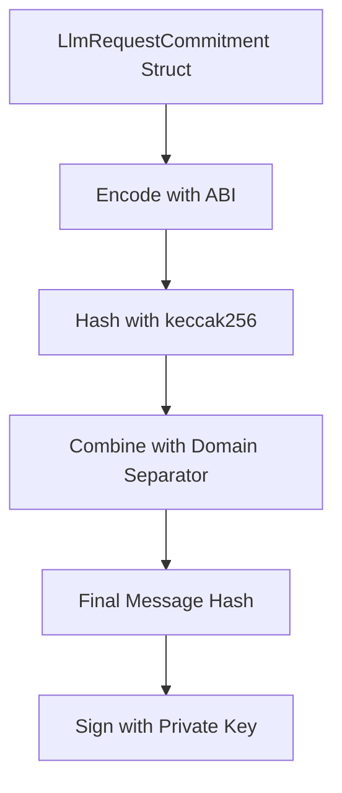
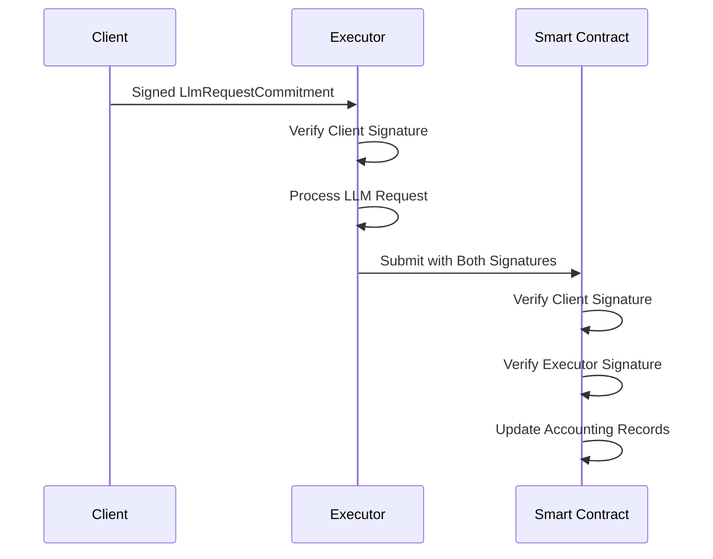

# EIP-712 Accounting System Technical Specification

## Executive Summary

This document specifies a comprehensive EIP-712 structured data signing scheme for the Lloom decentralized LLM network's accounting system. The design implements dual signature verification (client + executor) with pricing transparency, replay protection, and granular token accounting.

## 1. Current System Analysis

### 1.1 Existing Implementation Limitations

**Current Signing Method:**
- Uses simple keccak256 of JSON-serialized messages
- No standardized structure for signature verification
- Missing pricing information in signed data
- No executor address binding in client requests
- Limited replay protection mechanisms

**Current Smart Contract:**
- Only tracks total token counts (single field)  
- No signature verification capabilities
- No pricing model implementation
- Missing dual signature support

**Current Protocol Structure:**
```rust
// Existing structures lack pricing and accounting detail
LlmRequest { model, prompt, system_prompt, temperature, max_tokens }
LlmResponse { content, token_count, model_used, error }
UsageRecord { client_address, model, token_count, timestamp }
```

### 1.2 Required Enhancements

1. **Pricing Integration**: UINT256 inbound/outbound token prices
2. **Dual Signatures**: Client request signing + Executor response signing  
3. **Granular Accounting**: Separate inbound/outbound token tracking
4. **Replay Protection**: Client-specific nonce management
5. **Executor Binding**: Client must commit to specific executor and prices

## 2. EIP-712 Domain Structure

### 2.1 Domain Separator Definition

```solidity
struct EIP712Domain {
    string name;           // "Lloom Network"
    string version;        // "1.0.0"
    uint256 chainId;       // Network chain ID (e.g., 1 for mainnet, 11155111 for sepolia)
    address verifyingContract;  // Address of the Accounting smart contract
}
```

**Implementation Constants:**
```rust
pub const DOMAIN_NAME: &str = "Lloom Network";
pub const DOMAIN_VERSION: &str = "1.0.0";
pub const DOMAIN_TYPE_HASH: &str = "EIP712Domain(string name,string version,uint256 chainId,address verifyingContract)";
```

### 2.2 Domain Hash Calculation

```solidity
bytes32 DOMAIN_SEPARATOR = keccak256(abi.encode(
    keccak256("EIP712Domain(string name,string version,uint256 chainId,address verifyingContract)"),
    keccak256(bytes("Lloom Network")),
    keccak256(bytes("1.0.0")),
    chainId,
    address(this)
));
```

## 3. TypedData Structures

### 3.1 Client Request Signing

**Primary Structure: `LlmRequestCommitment`**
```solidity
struct LlmRequestCommitment {
    address executor;          // Chosen executor address
    string model;             // Model identifier  
    bytes32 promptHash;       // keccak256 of prompt content
    bytes32 systemPromptHash; // keccak256 of system prompt (or zero hash if none)
    uint32 maxTokens;         // Maximum tokens to generate
    uint32 temperature;       // Temperature * 10000 (e.g., 0.7 → 7000)
    uint256 inboundPrice;     // Price per inbound token (wei per token)
    uint256 outboundPrice;    // Price per outbound token (wei per token)
    uint64 nonce;             // Client nonce for replay protection
    uint64 deadline;          // Unix timestamp deadline
}
```

**Type Hash:**
```solidity
bytes32 constant LLMREQUEST_TYPEHASH = keccak256(
    "LlmRequestCommitment(address executor,string model,bytes32 promptHash,bytes32 systemPromptHash,uint32 maxTokens,uint32 temperature,uint256 inboundPrice,uint256 outboundPrice,uint64 nonce,uint64 deadline)"
);
```

**Rationale for Design Choices:**
- **promptHash/systemPromptHash**: Prevents prompt content leakage in on-chain data while maintaining integrity
- **executor binding**: Client commits to specific executor preventing man-in-the-middle attacks  
- **pricing commitment**: Client agrees to specific token prices upfront
- **temperature as uint32**: Fixed-point representation (temperature * 10000) for deterministic encoding
- **deadline**: Prevents indefinite commitment validity

### 3.2 Executor Response Signing

**Primary Structure: `LlmResponseCommitment`**
```solidity
struct LlmResponseCommitment {
    bytes32 requestHash;      // Hash of the original signed request
    address client;           // Client address who made request
    string model;             // Model actually used
    bytes32 contentHash;      // keccak256 of response content
    uint32 inboundTokens;     // Actual prompt tokens consumed
    uint32 outboundTokens;    // Actual completion tokens generated
    uint256 inboundPrice;     // Price per inbound token (must match request)
    uint256 outboundPrice;    // Price per outbound token (must match request)
    uint64 timestamp;         // Execution timestamp
    bool success;             // Whether request succeeded
}
```

**Type Hash:**
```solidity
bytes32 constant LLMRESPONSE_TYPEHASH = keccak256(
    "LlmResponseCommitment(bytes32 requestHash,address client,string model,bytes32 contentHash,uint32 inboundTokens,uint32 outboundTokens,uint256 inboundPrice,uint256 outboundPrice,uint64 timestamp,bool success)"
);
```

## 4. Pricing Model Specification

### 4.1 Price Representation

**Format:** UINT256 representing wei per token
- **Precision:** 18 decimal places (same as ETH)
- **Example:** 1000000000000000 wei = 0.001 ETH per token

**Price Discovery Mechanism:**
1. Executors advertise models and prices via P2P network
2. Clients select executor based on price/performance preferences  
3. Client commits to specific prices in signed request
4. Executor must honor committed prices or reject request

### 4.2 Cost Calculation

```solidity
uint256 totalCost = (inboundTokens * inboundPrice) + (outboundTokens * outboundPrice);
```

## 5. Nonce Management System

### 5.1 Client Nonce Structure

**Per-Client Nonce Tracking:**
```solidity
mapping(address => uint64) public clientNonces;
```

**Nonce Validation Rules:**
1. New request nonce MUST equal `clientNonces[client] + 1`
2. Successful request increments stored nonce
3. Failed requests do not increment nonce
4. Nonce prevents replay attacks and enforces ordering

### 5.2 Nonce Generation Strategy

**Client Side:**
```rust
impl NonceManager {
    fn get_next_nonce(&mut self, client: Address) -> u64 {
        let current = self.get_current_nonce(client).await;
        current + 1
    }
}
```

## 6. Token Accounting Structure

### 6.1 Granular Token Tracking

**Enhanced Usage Record:**
```solidity
struct DetailedUsageRecord {
    address executor;         // Executor who processed request
    address client;          // Client who made request  
    string model;            // Model used
    uint32 inboundTokens;    // Prompt tokens
    uint32 outboundTokens;   // Completion tokens
    uint256 inboundPrice;    // Price per inbound token
    uint256 outboundPrice;   // Price per outbound token
    uint256 totalCost;       // Total cost in wei
    uint64 timestamp;        // Block timestamp
    bool success;            // Request success status
}
```

### 6.2 Accounting Aggregations

**Per-Executor Statistics:**
```solidity
struct ExecutorStats {
    uint64 totalInboundTokens;
    uint64 totalOutboundTokens;  
    uint256 totalRevenue;
    uint32 requestCount;
    uint32 successfulRequests;
}
```

**Per-Client Statistics:**
```solidity
struct ClientStats {
    uint64 totalInboundTokens;
    uint64 totalOutboundTokens;
    uint256 totalSpent;
    uint32 requestCount;
}
```

## 7. Message Hash Calculation Flow

### 7.1 Client Request Hash



**Implementation:**
```solidity
bytes32 structHash = keccak256(abi.encode(
    LLMREQUEST_TYPEHASH,
    commitment.executor,
    keccak256(bytes(commitment.model)),
    commitment.promptHash,
    commitment.systemPromptHash,
    commitment.maxTokens,
    commitment.temperature,
    commitment.inboundPrice,
    commitment.outboundPrice,
    commitment.nonce,
    commitment.deadline
));

bytes32 messageHash = keccak256(abi.encodePacked(
    "\x19\x01",
    DOMAIN_SEPARATOR,
    structHash
));
```

### 7.2 Executor Response Hash


## 8. Signature Verification Order

### 8.1 Dual Signature Verification Process



### 8.2 Verification Implementation

**Client Signature Verification:**
```solidity
function verifyClientSignature(
    LlmRequestCommitment memory request,
    bytes memory clientSignature
) internal view returns (address) {
    bytes32 messageHash = getRequestMessageHash(request);
    return ECDSA.recover(messageHash, clientSignature);
}
```

**Executor Signature Verification:**
```solidity
function verifyExecutorSignature(
    LlmResponseCommitment memory response,
    bytes memory executorSignature  
) internal view returns (address) {
    bytes32 messageHash = getResponseMessageHash(response);
    return ECDSA.recover(messageHash, executorSignature);
}
```

## 9. Integration Points with Current Codebase

### 9.1 Protocol Structure Enhancements

**New Rust Structures:**
```rust
#[derive(Serialize, Deserialize, Debug, Clone)]
pub struct LlmRequestCommitment {
    pub executor: Address,
    pub model: String,
    pub prompt_hash: [u8; 32],
    pub system_prompt_hash: Option<[u8; 32]>,
    pub max_tokens: u32,
    pub temperature: u32, // Fixed point: actual_temp * 10000
    pub inbound_price: U256,
    pub outbound_price: U256,
    pub nonce: u64,
    pub deadline: u64,
}

#[derive(Serialize, Deserialize, Debug, Clone)]
pub struct LlmResponseCommitment {
    pub request_hash: [u8; 32],
    pub client: Address,
    pub model: String,
    pub content_hash: [u8; 32],
    pub inbound_tokens: u32,
    pub outbound_tokens: u32,
    pub inbound_price: U256,
    pub outbound_price: U256,
    pub timestamp: u64,
    pub success: bool,
}
```

### 9.2 Enhanced SignedMessage Structure

```rust
#[derive(Serialize, Deserialize, Debug, Clone)]
pub struct Eip712SignedMessage<T> {
    pub domain: Eip712Domain,
    pub payload: T,
    pub signature: [u8; 65],
    pub signer: Address,
}

#[derive(Serialize, Deserialize, Debug, Clone)]
pub struct Eip712Domain {
    pub name: String,
    pub version: String,
    pub chain_id: u64,
    pub verifying_contract: Address,
}
```

## 10. Smart Contract Function Signatures

### 10.1 Primary Processing Functions

**Single Signature (Executor Only):**
```solidity
function processRequest(
    LlmRequestCommitment calldata request,
    LlmResponseCommitment calldata response,
    bytes calldata clientSignature,
    string calldata promptContent,
    string calldata systemPromptContent,
    string calldata responseContent
) external;
```

**Dual Signature (Client + Executor):**
```solidity
function processRequestSigned(
    LlmRequestCommitment calldata request,
    LlmResponseCommitment calldata response,
    bytes calldata clientSignature,
    bytes calldata executorSignature
) external;
```

### 10.2 Enhanced Contract Interface

```solidity
contract AccountingV2 {
    // EIP-712 Domain
    bytes32 public immutable DOMAIN_SEPARATOR;
    
    // Nonce management
    mapping(address => uint64) public clientNonces;
    
    // Enhanced statistics
    mapping(address => ExecutorStats) public executorStats;
    mapping(address => ClientStats) public clientStats;
    
    // Events
    event RequestProcessed(
        bytes32 indexed requestHash,
        address indexed client,
        address indexed executor,
        string model,
        uint32 inboundTokens,
        uint32 outboundTokens,
        uint256 totalCost,
        bool success
    );
    
    event PriceCommitment(
        address indexed client,
        address indexed executor,
        string model,
        uint256 inboundPrice,
        uint256 outboundPrice
    );
}
```

## 11. Security Considerations

### 11.1 Replay Attack Prevention

1. **Nonce Management**: Strict incremental nonce validation
2. **Deadline Enforcement**: Requests expire after deadline
3. **Request Hash Binding**: Response must reference specific request hash

### 11.2 Price Manipulation Protection  

1. **Price Commitment**: Client commits to prices in signed request
2. **Executor Verification**: Executor must use committed prices
3. **Audit Trail**: All price commitments logged on-chain

### 11.3 Front-running Protection

1. **Hash-based Prompts**: Prompt content not revealed until execution
2. **Executor Binding**: Client selects specific executor address
3. **Deadline Pressure**: Time-limited request validity

## 12. Implementation Phases

### Phase 1: Core EIP-712 Infrastructure
- [ ] Implement EIP-712 domain and type hash calculations
- [ ] Create Rust structures for commitments
- [ ] Build signature creation and verification utilities

### Phase 2: Protocol Integration
- [ ] Update protocol.rs with new commitment structures
- [ ] Modify signing.rs for EIP-712 compatibility
- [ ] Implement nonce management system

### Phase 3: Smart Contract Development
- [ ] Develop AccountingV2 contract with EIP-712 verification
- [ ] Implement dual signature validation
- [ ] Add enhanced statistics and events

### Phase 4: Client/Executor Integration
- [ ] Update client to create EIP-712 request commitments
- [ ] Modify executor to verify client signatures and create response commitments
- [ ] Integrate with blockchain submission pipeline

### Phase 5: Testing & Deployment
- [ ] Comprehensive unit tests for all components
- [ ] Integration tests for full signature flow
- [ ] Testnet deployment and validation

## 13. Conclusion

This EIP-712 accounting system specification provides:

1. **Cryptographic Integrity**: Structured data signing prevents tampering
2. **Price Transparency**: Clear pricing commitments with audit trails  
3. **Granular Accounting**: Separate tracking of inbound/outbound tokens and costs
4. **Replay Protection**: Nonce-based ordering with deadline enforcement
5. **Dual Verification**: Both client and executor signatures ensure accountability

The design maintains backward compatibility during transition while providing a robust foundation for a production-ready decentralized LLM marketplace with transparent pricing and comprehensive accounting.