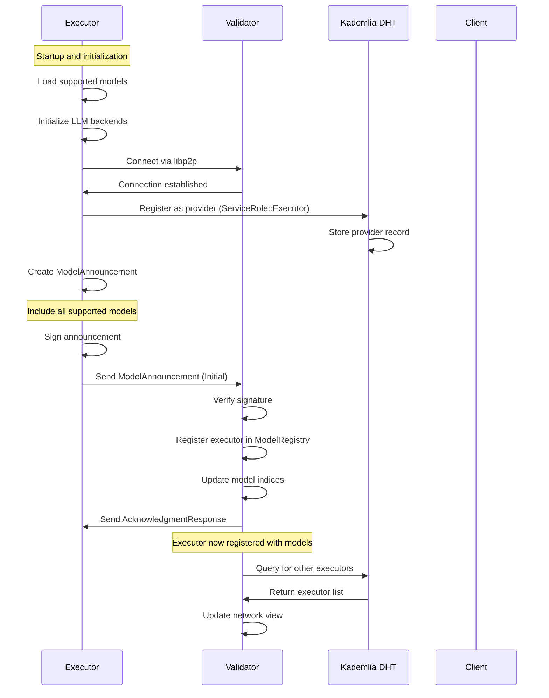
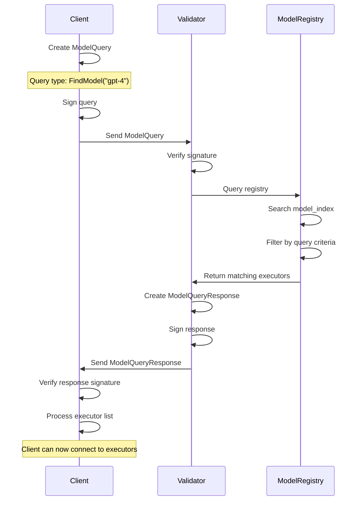
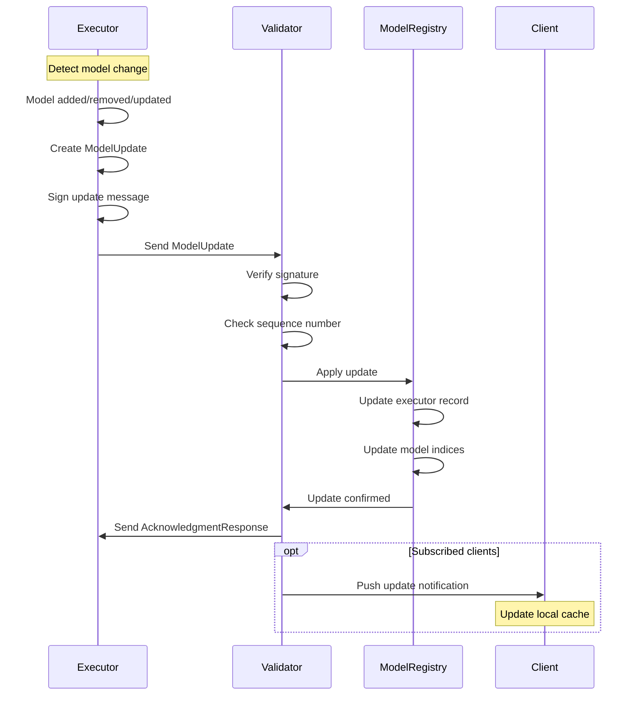
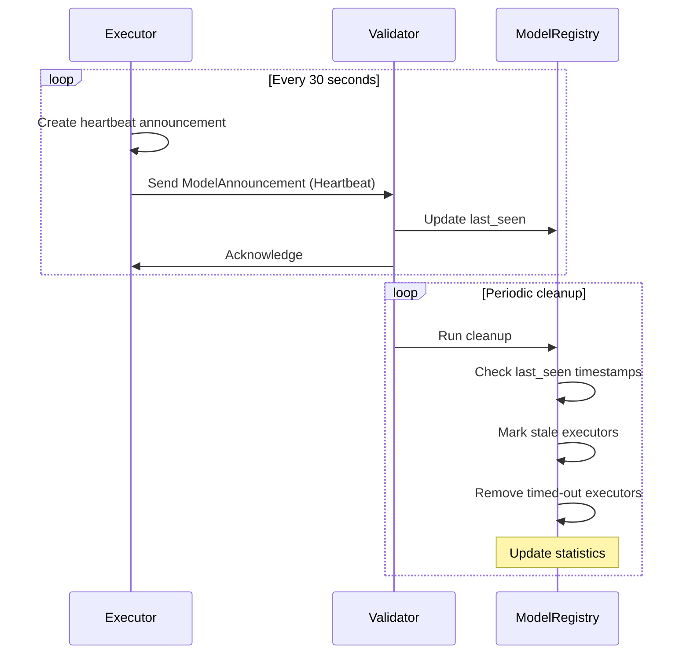

# Model Announcement Protocol Design

## Executive Summary

This document outlines the design for a model announcement system in the crowd_models project that enables executors to announce their supported models, validators to maintain a registry of available models, and clients to discover which models are available in the network.

## 1. Protocol Messages

### 1.1 Core Message Types

#### ModelAnnouncement (Executor → Validator)

```rust
/// Announcement message sent by executors to validators
#[derive(Serialize, Deserialize, Debug, Clone)]
pub struct ModelAnnouncement {
    /// Executor's peer ID
    pub executor_peer_id: libp2p::PeerId,
    
    /// Executor's EVM address for on-chain verification
    pub executor_address: Address,
    
    /// List of supported models with their capabilities
    pub models: Vec<ModelDescriptor>,
    
    /// Announcement type (initial/update/removal)
    pub announcement_type: AnnouncementType,
    
    /// Unix timestamp of the announcement
    pub timestamp: u64,
    
    /// Nonce for replay protection
    pub nonce: u64,
    
    /// Protocol version for compatibility
    pub protocol_version: u8,
}

/// Individual model descriptor with capabilities
#[derive(Serialize, Deserialize, Debug, Clone)]
pub struct ModelDescriptor {
    /// Model identifier (e.g., "gpt-4", "llama-2-7b")
    pub model_id: String,
    
    /// Backend type (e.g., "openai", "lmstudio", "custom")
    pub backend_type: String,
    
    /// Model capabilities and metadata
    pub capabilities: ModelCapabilities,
    
    /// Current availability status
    pub is_available: bool,
    
    /// Pricing information (optional)
    pub pricing: Option<ModelPricing>,
}

/// Model capabilities and metadata
#[derive(Serialize, Deserialize, Debug, Clone)]
pub struct ModelCapabilities {
    /// Maximum context length in tokens
    pub max_context_length: u32,
    
    /// Supported features
    pub features: Vec<String>,  // e.g., ["chat", "completion", "embeddings"]
    
    /// Model architecture (optional)
    pub architecture: Option<String>,
    
    /// Model size/parameters (optional)
    pub model_size: Option<String>,
    
    /// Performance metrics (optional)
    pub performance: Option<PerformanceMetrics>,
    
    /// Additional metadata as key-value pairs
    pub metadata: HashMap<String, serde_json::Value>,
}

/// Performance metrics for a model
#[derive(Serialize, Deserialize, Debug, Clone)]
pub struct PerformanceMetrics {
    /// Average tokens per second
    pub avg_tokens_per_second: Option<f64>,
    
    /// Average time to first token (in seconds)
    pub avg_time_to_first_token: Option<f64>,
    
    /// Success rate (0.0 to 1.0)
    pub success_rate: Option<f64>,
    
    /// Average latency in milliseconds
    pub avg_latency_ms: Option<u64>,
}

/// Pricing information for a model
#[derive(Serialize, Deserialize, Debug, Clone)]
pub struct ModelPricing {
    /// Price per input token in wei (as string for large numbers)
    pub input_token_price: String,
    
    /// Price per output token in wei
    pub output_token_price: String,
    
    /// Minimum request fee (if any)
    pub minimum_fee: Option<String>,
}

/// Type of announcement
#[derive(Serialize, Deserialize, Debug, Clone, PartialEq)]
pub enum AnnouncementType {
    /// Initial announcement when executor connects
    Initial,
    /// Update to existing model list
    Update,
    /// Graceful removal before disconnect
    Removal,
    /// Heartbeat to maintain presence
    Heartbeat,
}
```

#### ModelQuery (Client → Validator)

```rust
/// Query from client to validator for model information
#[derive(Serialize, Deserialize, Debug, Clone)]
pub struct ModelQuery {
    /// Type of query
    pub query_type: ModelQueryType,
    
    /// Optional filters for the query
    pub filters: Option<QueryFilters>,
    
    /// Maximum number of results (for pagination)
    pub limit: Option<u32>,
    
    /// Offset for pagination
    pub offset: Option<u32>,
    
    /// Query ID for response correlation
    pub query_id: String,
    
    /// Timestamp of the query
    pub timestamp: u64,
}

/// Type of model query
#[derive(Serialize, Deserialize, Debug, Clone)]
pub enum ModelQueryType {
    /// List all available models
    ListAllModels,
    /// Find executors for a specific model
    FindModel(String),
    /// Get detailed info about specific executors
    ExecutorInfo(Vec<libp2p::PeerId>),
    /// Search models by capabilities
    SearchByCapabilities,
    /// Get statistics about model availability
    GetStatistics,
}

/// Filters for model queries
#[derive(Serialize, Deserialize, Debug, Clone)]
pub struct QueryFilters {
    /// Filter by backend type
    pub backend_type: Option<String>,
    
    /// Minimum required context length
    pub min_context_length: Option<u32>,
    
    /// Required features
    pub required_features: Option<Vec<String>>,
    
    /// Maximum price per token (in wei)
    pub max_price: Option<String>,
    
    /// Only show available models
    pub only_available: bool,
    
    /// Minimum success rate
    pub min_success_rate: Option<f64>,
}
```

#### ModelQueryResponse (Validator → Client)

```rust
/// Response from validator to client's model query
#[derive(Serialize, Deserialize, Debug, Clone)]
pub struct ModelQueryResponse {
    /// Query ID this responds to
    pub query_id: String,
    
    /// Query results
    pub result: QueryResult,
    
    /// Total count (for pagination)
    pub total_count: Option<u32>,
    
    /// Response timestamp
    pub timestamp: u64,
    
    /// Validator's peer ID
    pub validator_peer_id: libp2p::PeerId,
}

/// Query result variants
#[derive(Serialize, Deserialize, Debug, Clone)]
pub enum QueryResult {
    /// List of models with their executors
    ModelList(Vec<ModelEntry>),
    /// List of executors for a specific model
    ExecutorList(Vec<ExecutorEntry>),
    /// Detailed executor information
    ExecutorDetails(Vec<ExecutorDetail>),
    /// Network statistics
    Statistics(NetworkStatistics),
    /// Error response
    Error(QueryError),
}

/// Model entry in query response
#[derive(Serialize, Deserialize, Debug, Clone)]
pub struct ModelEntry {
    /// Model identifier
    pub model_id: String,
    
    /// Number of executors supporting this model
    pub executor_count: u32,
    
    /// List of executor peer IDs
    pub executors: Vec<libp2p::PeerId>,
    
    /// Aggregated capabilities (best available)
    pub capabilities: ModelCapabilities,
    
    /// Average pricing across executors
    pub avg_pricing: Option<ModelPricing>,
}

/// Executor entry in query response
#[derive(Serialize, Deserialize, Debug, Clone)]
pub struct ExecutorEntry {
    /// Executor's peer ID
    pub peer_id: libp2p::PeerId,
    
    /// Executor's EVM address
    pub evm_address: Address,
    
    /// Connection status
    pub is_connected: bool,
    
    /// Last seen timestamp
    pub last_seen: u64,
    
    /// Reliability score (0.0 to 1.0)
    pub reliability_score: Option<f64>,
}

/// Detailed executor information
#[derive(Serialize, Deserialize, Debug, Clone)]
pub struct ExecutorDetail {
    /// Basic executor info
    pub executor: ExecutorEntry,
    
    /// All models supported by this executor
    pub models: Vec<ModelDescriptor>,
    
    /// Performance statistics
    pub stats: Option<ExecutorStatistics>,
}

/// Error response for queries
#[derive(Serialize, Deserialize, Debug, Clone)]
pub struct QueryError {
    /// Error code
    pub code: u32,
    
    /// Error message
    pub message: String,
    
    /// Additional details
    pub details: Option<String>,
}
```

#### ModelUpdate (Executor → Validator)

```rust
/// Update message for model changes
#[derive(Serialize, Deserialize, Debug, Clone)]
pub struct ModelUpdate {
    /// Executor's peer ID
    pub executor_peer_id: libp2p::PeerId,
    
    /// Type of update
    pub update_type: UpdateType,
    
    /// Updated model information
    pub updates: Vec<ModelUpdateEntry>,
    
    /// Timestamp of the update
    pub timestamp: u64,
    
    /// Update sequence number for ordering
    pub sequence: u64,
}

/// Type of model update
#[derive(Serialize, Deserialize, Debug, Clone)]
pub enum UpdateType {
    /// Add new models
    AddModels,
    /// Remove models
    RemoveModels,
    /// Update model capabilities
    UpdateCapabilities,
    /// Update pricing
    UpdatePricing,
    /// Update availability
    UpdateAvailability,
}

/// Individual model update entry
#[derive(Serialize, Deserialize, Debug, Clone)]
pub struct ModelUpdateEntry {
    /// Model identifier
    pub model_id: String,
    
    /// New descriptor (for adds/updates)
    pub descriptor: Option<ModelDescriptor>,
    
    /// Update reason
    pub reason: Option<String>,
}
```

### 1.2 Network Message Integration

Extend the existing `RequestMessage` and `ResponseMessage` enums in [`protocol.rs`](crates/lloom-core/src/protocol.rs):

```rust
/// Extended request messages
#[derive(Serialize, Deserialize, Debug, Clone)]
pub enum RequestMessage {
    // Existing variants
    LlmRequest(LlmRequest),
    SignedLlmRequest(SignedLlmRequest),
    
    // New model announcement variants
    ModelAnnouncement(SignedMessage<ModelAnnouncement>),
    ModelQuery(SignedMessage<ModelQuery>),
    ModelUpdate(SignedMessage<ModelUpdate>),
}

/// Extended response messages
#[derive(Serialize, Deserialize, Debug, Clone)]
pub enum ResponseMessage {
    // Existing variants
    LlmResponse(LlmResponse),
    SignedLlmResponse(SignedLlmResponse),
    
    // New model announcement variants
    ModelQueryResponse(SignedMessage<ModelQueryResponse>),
    AcknowledgmentResponse(SignedMessage<AcknowledgmentResponse>),
}

/// Simple acknowledgment response
#[derive(Serialize, Deserialize, Debug, Clone)]
pub struct AcknowledgmentResponse {
    /// Request ID being acknowledged
    pub request_id: String,
    
    /// Success status
    pub success: bool,
    
    /// Optional message
    pub message: Option<String>,
    
    /// Timestamp
    pub timestamp: u64,
}
```

## 2. Validator Model Registry

### 2.1 Core Data Structures

```rust
/// Main model registry maintained by validators
pub struct ModelRegistry {
    /// Map of executor peer ID to their information
    executors: HashMap<libp2p::PeerId, ExecutorRecord>,
    
    /// Index of model ID to executor peer IDs
    model_index: HashMap<String, HashSet<libp2p::PeerId>>,
    
    /// Connection status tracking
    connection_status: HashMap<libp2p::PeerId, ConnectionStatus>,
    
    /// Performance statistics per executor
    executor_stats: HashMap<libp2p::PeerId, ExecutorStatistics>,
    
    /// Global network statistics
    network_stats: NetworkStatistics,
    
    /// Configuration for the registry
    config: RegistryConfig,
}

/// Record for an individual executor
#[derive(Debug, Clone)]
pub struct ExecutorRecord {
    /// Executor's peer ID
    pub peer_id: libp2p::PeerId,
    
    /// Executor's EVM address
    pub evm_address: Address,
    
    /// Supported models
    pub models: HashMap<String, ModelDescriptor>,
    
    /// Last announcement timestamp
    pub last_announcement: u64,
    
    /// Last update timestamp
    pub last_update: u64,
    
    /// Announcement sequence number
    pub sequence: u64,
    
    /// Protocol version
    pub protocol_version: u8,
}

/// Connection status for an executor
#[derive(Debug, Clone)]
pub struct ConnectionStatus {
    /// Current connection state
    pub state: ConnectionState,
    
    /// Last seen timestamp
    pub last_seen: u64,
    
    /// Number of reconnections
    pub reconnect_count: u32,
    
    /// Total uptime in seconds
    pub total_uptime: u64,
    
    /// Connection quality score (0.0 to 1.0)
    pub quality_score: f64,
}

/// Connection states
#[derive(Debug, Clone, PartialEq)]
pub enum ConnectionState {
    Connected,
    Disconnected,
    Stale,  // No heartbeat received
    Unknown,
}

/// Executor performance statistics
#[derive(Debug, Clone, Default)]
pub struct ExecutorStatistics {
    /// Total requests handled
    pub total_requests: u64,
    
    /// Successful requests
    pub successful_requests: u64,
    
    /// Failed requests
    pub failed_requests: u64,
    
    /// Average response time in ms
    pub avg_response_time: u64,
    
    /// Total tokens processed
    pub total_tokens: u64,
    
    /// Last updated timestamp
    pub last_updated: u64,
}

/// Global network statistics
#[derive(Debug, Clone, Default)]
pub struct NetworkStatistics {
    /// Total number of executors
    pub total_executors: u32,
    
    /// Total number of unique models
    pub total_models: u32,
    
    /// Currently connected executors
    pub connected_executors: u32,
    
    /// Total requests processed
    pub total_requests: u64,
    
    /// Network uptime in seconds
    pub uptime: u64,
    
    /// Last reset timestamp
    pub last_reset: u64,
}

/// Registry configuration
#[derive(Debug, Clone)]
pub struct RegistryConfig {
    /// Maximum time before marking executor as stale (seconds)
    pub stale_timeout: u64,
    
    /// Maximum time before removing disconnected executor (seconds)
    pub removal_timeout: u64,
    
    /// Maximum executors to track
    pub max_executors: usize,
    
    /// Maximum models per executor
    pub max_models_per_executor: usize,
    
    /// Enable performance tracking
    pub track_performance: bool,
    
    /// Persistence interval (seconds)
    pub persistence_interval: u64,
}
```

### 2.2 Registry Operations

```rust
impl ModelRegistry {
    /// Create a new model registry
    pub fn new(config: RegistryConfig) -> Self {
        Self {
            executors: HashMap::new(),
            model_index: HashMap::new(),
            connection_status: HashMap::new(),
            executor_stats: HashMap::new(),
            network_stats: NetworkStatistics::default(),
            config,
        }
    }
    
    /// Handle a model announcement from an executor
    pub fn handle_announcement(&mut self, announcement: &ModelAnnouncement) -> Result<()> {
        match announcement.announcement_type {
            AnnouncementType::Initial => self.register_executor(announcement),
            AnnouncementType::Update => self.update_executor(announcement),
            AnnouncementType::Removal => self.remove_executor(&announcement.executor_peer_id),
            AnnouncementType::Heartbeat => self.update_heartbeat(&announcement.executor_peer_id),
        }
    }
    
    /// Register a new executor
    fn register_executor(&mut self, announcement: &ModelAnnouncement) -> Result<()> {
        // Check capacity
        if self.executors.len() >= self.config.max_executors {
            return Err(Error::RegistryFull);
        }
        
        // Create executor record
        let record = ExecutorRecord {
            peer_id: announcement.executor_peer_id,
            evm_address: announcement.executor_address,
            models: announcement.models.iter()
                .map(|m| (m.model_id.clone(), m.clone()))
                .collect(),
            last_announcement: announcement.timestamp,
            last_update: announcement.timestamp,
            sequence: announcement.nonce,
            protocol_version: announcement.protocol_version,
        };
        
        // Update indices
        for model in &announcement.models {
            self.model_index
                .entry(model.model_id.clone())
                .or_insert_with(HashSet::new)
                .insert(announcement.executor_peer_id);
        }
        
        // Store record
        self.executors.insert(announcement.executor_peer_id, record);
        
        // Initialize connection status
        self.connection_status.insert(
            announcement.executor_peer_id,
            ConnectionStatus {
                state: ConnectionState::Connected,
                last_seen: announcement.timestamp,
                reconnect_count: 0,
                total_uptime: 0,
                quality_score: 1.0,
            },
        );
        
        // Update statistics
        self.network_stats.total_executors += 1;
        self.network_stats.connected_executors += 1;
        self.update_model_count();
        
        Ok(())
    }
    
    /// Handle executor disconnection
    pub fn handle_disconnection(&mut self, peer_id: &libp2p::PeerId) {
        if let Some(status) = self.connection_status.get_mut(peer_id) {
            status.state = ConnectionState::Disconnected;
            status.last_seen = current_timestamp();
            self.network_stats.connected_executors = 
                self.network_stats.connected_executors.saturating_sub(1);
        }
    }
    
    /// Query for models
    pub fn query_models(&self, query: &ModelQuery) -> QueryResult {
        match &query.query_type {
            ModelQueryType::ListAllModels => self.list_all_models(query.filters.as_ref()),
            ModelQueryType::FindModel(model_id) => self.find_model(model_id),
            ModelQueryType::ExecutorInfo(peer_ids) => self.get_executor_info(peer_ids),
            ModelQueryType::SearchByCapabilities => self.search_by_capabilities(query.filters.as_ref()),
            ModelQueryType::GetStatistics => QueryResult::Statistics(self.network_stats.clone()),
        }
    }
    
    /// Clean up stale and disconnected executors
    pub fn cleanup(&mut self) {
        let now = current_timestamp();
        let mut to_remove = Vec::new();
        
        for (peer_id, status) in &self.connection_status {
            let age = now - status.last_seen;
            
            match status.state {
                ConnectionState::Connected if age > self.config.stale_timeout => {
                    // Mark as stale
                    if let Some(status) = self.connection_status.get_mut(peer_id) {
                        status.state = ConnectionState::Stale;
                    }
                }
                ConnectionState::Disconnected | ConnectionState::Stale 
                    if age > self.config.removal_timeout => {
                    // Schedule for removal
                    to_remove.push(*peer_id);
                }
                _ => {}
            }
        }
        
        // Remove stale executors
        for peer_id in to_remove {
            self.remove_executor(&peer_id);
        }
    }
}
```

## 3. Communication Flow Diagrams

### 3.1 Initial Executor Connection and Announcement



### 3.2 Client Model Discovery



### 3.3 Model Update Flow



### 3.4 Heartbeat and Cleanup



## 4. Error Handling

### 4.1 Error Scenarios and Responses

| Scenario | Detection | Response | Recovery |
|----------|-----------|----------|----------|
| **Invalid Signature** | Signature verification fails | Reject message, log security event | Client/Executor must re-send with valid signature |
| **Replay Attack** | Nonce/timestamp validation fails | Reject message, alert | Update nonce tracking |
| **Registry Full** | Max executors reached | Return error response | Admin intervention or auto-cleanup |
| **Model Limit Exceeded** | Too many models per executor | Partial registration | Executor must reduce model count |
| **Protocol Version Mismatch** | Version check fails | Negotiate or reject | Upgrade required |
| **Stale Executor** | No heartbeat timeout | Mark as stale | Wait for reconnection or cleanup |
| **Network Partition** | Connection lost | Mark disconnected | Automatic reconnection attempts |
| **Invalid Model ID** | Model not found | Return empty result | Client handles gracefully |
| **Query Timeout** | Response not received | Client timeout | Retry with backoff |
| **Duplicate Announcement** | Same nonce received | Ignore duplicate | No action needed |

### 4.2 Error Codes

```rust
/// Standard error codes for model announcement protocol
pub enum ErrorCode {
    // Authentication/Authorization errors (1000-1999)
    InvalidSignature = 1001,
    Unauthorized = 1002,
    ExpiredMessage = 1003,
    ReplayDetected = 1004,
    
    // Registry errors (2000-2999)
    RegistryFull = 2001,
    ExecutorNotFound = 2002,
    ModelNotFound = 2003,
    DuplicateRegistration = 2004,
    ModelLimitExceeded = 2005,
    
    // Protocol errors (3000-3999)
    InvalidProtocolVersion = 3001,
    MalformedMessage = 3002,
    UnsupportedQueryType = 3003,
    
    // Network errors (4000-4999)
    ConnectionLost = 4001,
    Timeout = 4002,
    NetworkPartition = 4003,
    
    // Internal errors (5000-5999)
    InternalError = 5000,
    StorageError = 5001,
    ConfigurationError = 5002,
}
```

## 5. Integration Points

### 5.1 Executor Integration

Location: [`crates/lloom-executor/src/main.rs`](crates/lloom-executor/src/main.rs)

```rust
// In main() after network initialization
async fn announce_models(
    swarm: &mut Swarm<LloomBehaviour>,
    state: &ExecutorState,
) -> Result<()> {
    // Collect all supported models from LLM clients
    let mut models = Vec::new();
    
    for (backend_name, client) in &state.llm_clients {
        let backend_config = state.config.llm_backends.iter()
            .find(|b| b.name == *backend_name)
            .unwrap();
        
        for model_id in &backend_config.supported_models {
            models.push(ModelDescriptor {
                model_id: model_id.clone(),
                backend_type: backend_name.clone(),
                capabilities: ModelCapabilities {
                    max_context_length: 4096, // From config
                    features: vec!["chat".to_string(), "completion".to_string()],
                    architecture: None,
                    model_size: None,
                    performance: None,
                    metadata: HashMap::new(),
                },
                is_available: true,
                pricing: Some(ModelPricing {
                    input_token_price: "500000000000000".to_string(),
                    output_token_price: "1000000000000000".to_string(),
                    minimum_fee: None,
                }),
            });
        }
    }
    
    // Create and sign announcement
    let announcement = ModelAnnouncement {
        executor_peer_id: state.identity.peer_id,
        executor_address: state.identity.evm_address,
        models,
        announcement_type: AnnouncementType::Initial,
        timestamp: current_timestamp(),
        nonce: generate_nonce(),
        protocol_version: 1,
    };
    
    let signed_announcement = announcement.sign_blocking(&state.identity.wallet)?;
    
    // Send to connected validators
    // ... (use request-response or gossipsub)
    
    Ok(())
}
```

### 5.2 Validator Integration

Location: [`crates/lloom-validator/src/main.rs`](crates/lloom-validator/src/main.rs)

```rust
// Add to validator state
struct ValidatorState {
    identity: Identity,
    model_registry: ModelRegistry,
    // ... existing fields
}

// In handle_swarm_event()
SwarmEvent::Behaviour(LloomEvent::RequestResponse(
    request_response::Event::Message { message, peer, .. }
)) => {
    match message {
        request_response::Message::Request { request, channel, .. } => {
            match request {
                RequestMessage::ModelAnnouncement(signed_announcement) => {
                    handle_model_announcement(state, signed_announcement, channel).await;
                }
                RequestMessage::ModelQuery(signed_query) => {
                    handle_model_query(state, signed_query, channel).await;
                }
                RequestMessage::ModelUpdate(signed_update) => {
                    handle_model_update(state, signed_update, channel).await;
                }
                // ... existing cases
            }
        }
        // ... existing code
    }
}
```

### 5.3 Client Integration

Location: `crates/lloom-client/src/` (new functionality)

```rust
/// Query validators for available models
pub async fn discover_models(
    swarm: &mut Swarm<LloomBehaviour>,
    model_id: Option<String>,
) -> Result<Vec<ExecutorEntry>> {
    // Create query
    let query = ModelQuery {
        query_type: match model_id {
            Some(id) => ModelQueryType::FindModel(id),
            None => ModelQueryType::ListAllModels,
        },
        filters: None,
        limit: Some(100),
        offset: None,
        query_id: generate_query_id(),
        timestamp: current_timestamp(),
    };
    
    // Sign and send to validator
    let signed_query = query.sign_blocking(&identity.wallet)?;
    
    // Send query and await response
    // ... (implementation details)
    
    Ok(executors)
}
```

## 6. Usage Examples

### 6.1 Executor Announcing Models

```rust
// Example: Executor with multiple LLM backends
let executor = ExecutorState::new(config, identity);

// On startup
executor.announce_initial_models(&mut swarm).await?;

// When LMStudio loads a new model
executor.send_model_update(
    UpdateType::AddModels,
    vec![ModelUpdateEntry {
        model_id: "llama-2-13b".to_string(),
        descriptor: Some(ModelDescriptor {
            model_id: "llama-2-13b".to_string(),
            backend_type: "lmstudio".to_string(),
            capabilities: ModelCapabilities {
                max_context_length: 4096,
                features: vec!["chat".to_string()],
                architecture: Some("transformer".to_string()),
                model_size: Some("13B".to_string()),
                performance: Some(PerformanceMetrics {
                    avg_tokens_per_second: Some(15.5),
                    avg_time_to_first_token: Some(0.8),
                    success_rate: Some(0.99),
                    avg_latency_ms: Some(250),
                }),
                metadata: HashMap::new(),
            },
            is_available: true,
            pricing: None, // Free local model
        }),
        reason: Some("Model loaded in LMStudio".to_string()),
    }],
    &mut swarm
).await?;

// Periodic heartbeat
tokio::spawn(async move {
    let mut interval = interval(Duration::from_secs(30));
    loop {
        interval.tick().await;
        executor.send_heartbeat(&mut swarm).await;
    }
});
```

### 6.2 Client Discovering Models

```rust
// Example: Client looking for GPT-4 capable executors
let client = ClientState::new(identity);

// Query for specific model
let query = ModelQuery {
    query_type: ModelQueryType::FindModel("gpt-4".to_string()),
    filters: Some(QueryFilters {
        backend_type: None,
        min_context_length: Some(8000),
        required_features: Some(vec!["chat".to_string()]),
        max_price: Some("2000000000000000".to_string()), // 0.002 ETH per token
        only_available: true,
        min_success_rate: Some(0.95),
    }),
    limit: Some(10),
    offset: None,
    query_id: Uuid::new_v4().to_string(),
    timestamp: current_timestamp(),
};

let response = client.query_validator(query, &mut swarm).await?;

match response.result {
    QueryResult::ExecutorList(executors) => {
        println!("Found {} executors supporting GPT-4:", executors.len());
        for executor in executors {
            println!("  - {} (reliability: {:.2}%)", 
                     executor.peer_id, 
                     executor.reliability_score.unwrap_or(0.0) * 100.0);
        }
    }
    QueryResult::Error(error) => {
        eprintln!("Query failed: {}", error.message);
    }
    _ => {}
}
```

### 6.3 Validator Managing Registry

```rust
// Example: Validator with registry management
let mut validator = ValidatorState {
    identity,
    model_registry: ModelRegistry::new(RegistryConfig {
        stale_timeout: 60,        // 1 minute
        removal_timeout: 300,     // 5 minutes
        max_executors: 1000,
        max_models_per_executor: 50,
        track_performance: true,
        persistence_interval: 300, // 5 minutes
    }),
};

// Handle incoming announcement
match announcement.verify_signature() {
    Ok(signer) => {
        validator.model_registry.handle_announcement(&announcement)?;
        info!("Registered executor {} with {} models", 
              announcement.executor_peer_id,
              announcement.models.len());
    }
    Err(e) => {
        warn!("Invalid announcement signature: {}", e);
    }
}

// Periodic cleanup
tokio::spawn(async move {
    let mut interval = interval(Duration::from_secs(60));
    loop {
        interval.tick().await;
        validator.model_registry.cleanup();
        
        let stats = &validator.model_registry.network_stats;
        info!("Registry stats: {} executors, {} models, {} connected",
              stats.total_executors,
              stats.total_models,
              stats.connected_executors);
    }
});

// Handle client query
let result = validator.model_registry.query_models(&query);
let response = ModelQueryResponse {
    query_id: query.query_id.clone(),
    result,
    total_count: None,
    timestamp: current_timestamp(),
    validator_peer_id: validator.identity.peer_id,
};
```

## 7. Backwards Compatibility

The design maintains backwards compatibility by:

1. **Extending existing enums**: New message types are added to existing `RequestMessage` and `ResponseMessage` enums
2. **Protocol versioning**: Include `protocol_version` field for future upgrades
3. **Graceful degradation**: Nodes that don't understand new messages can ignore them
4. **Dual announcement**: Executors still register in Kademlia DHT for discovery by older clients
5. **Optional features**: Model capabilities and pricing are optional fields

## 8. Security Considerations

1. **Message signing**: All messages are signed to prevent spoofing
2. **Replay protection**: Nonce and timestamp validation
3. **Rate limiting**: Validators should limit query frequency per client
4. **Resource limits**: Maximum models per executor, maximum registry size
5. **Signature verification**: All signatures verified before processing
6. **EVM address binding**: Executor's peer ID bound to EVM address for on-chain verification

## 9. Performance Considerations

1. **Efficient indexing**: Model registry uses hash maps for O(1) lookups
2. **Lazy cleanup**: Stale executors cleaned up periodically, not immediately
3. **Batched updates**: Multiple model changes can be sent in one update
4. **Pagination support**: Large query results can be paginated
5. **Caching**: Clients can cache query results with TTL
6. **Heartbeat optimization**: Lightweight heartbeat messages minimize overhead

## 10. Future Enhancements

1. **Model discovery protocol**: Automatic discovery of model capabilities
2. **Quality of Service**: Track and report QoS metrics per executor
3. **Load balancing**: Distribute requests based on executor load
4. **Model versioning**: Support for multiple versions of the same model
5. **Federation**: Multiple validators sharing registry information
6. **Persistent storage**: Save registry state to disk for recovery
7. **WebSocket subscriptions**: Real-time updates for model changes
8. **Model benchmarking**: Automated performance testing of models