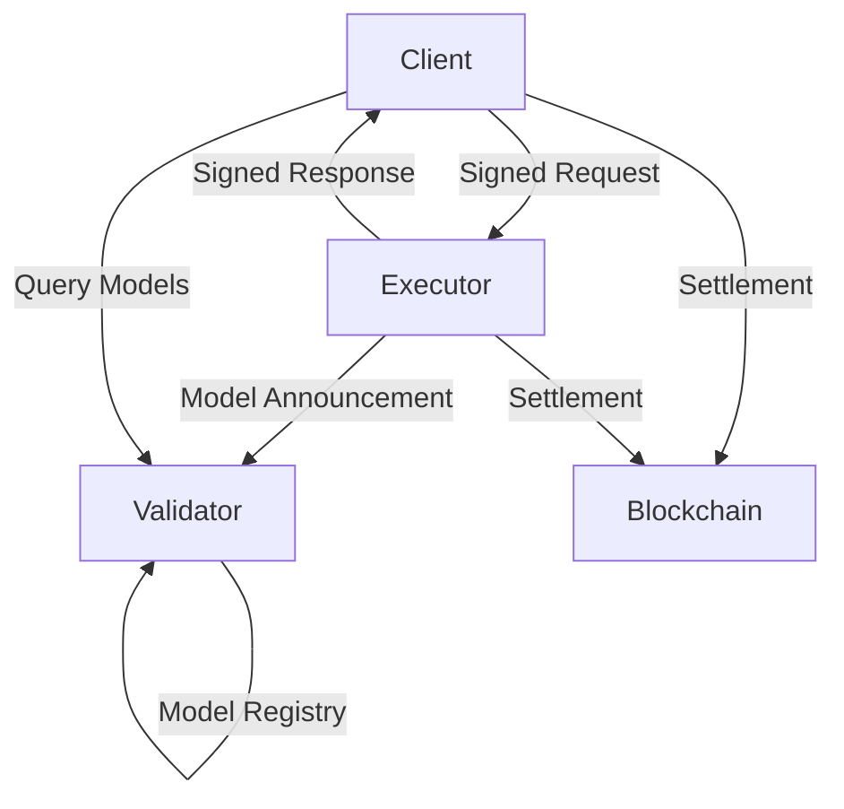

# 🌐 Lloom - Inference protocol. Peer-to-Peer

[](https://opensource.org/licenses/MIT)
[](https://www.rust-lang.org)
[](https://libp2p.io)

**Lloom** is a cutting-edge decentralized peer-to-peer network that creates a trustless marketplace for Large Language Model (LLM) services. Built with Rust for blazing-fast performance and rock-solid reliability, Lloom enables direct connections between AI consumers and providers without intermediaries.

## ✨ Key Features

### 🔐 **Cryptographically Secure**
- EIP-712 structured data signing for tamper-proof messages
- Ethereum-compatible identity system with wallet integration
- Dual-signature verification ensuring accountability
- Replay attack protection with nonce management

### 🌍 **Truly Decentralized**
- No single point of failure or control
- Peer-to-peer communication via libp2p networking stack
- Kademlia DHT for distributed discovery
- Self-organizing network topology

### 🤖 **Universal LLM Support**
- Compatible with OpenAI, LMStudio, and custom backends
- Dynamic model discovery and announcement protocol
- Real-time capability matching
- Automatic executor selection based on requirements

### 💰 **Transparent Economics**
- On-chain settlement with smart contracts
- Granular token usage tracking (input/output)
- Market-driven pricing discovery
- Fair compensation for compute providers

## 🚀 Quick Start

For quick start please try our demo that connects to LLOOM network and asks
"gpt-oss:20b" for introduction.

```bash
# Clone the repository
git clone https://github.com/dexloom/lloom
cd lloom

cargo run -p lloom-client -- --demo


```

## 🏗️ Architecture

Lloom operates with three primary node types:

- **🔹 Clients**: Request LLM inference services and pay for usage
- **🔸 Executors**: Provide computational resources and earn tokens
- **🔺 Validators**: Maintain network integrity and facilitate discovery



## 📦 Components

| Component | Description |
|-----------|-------------|
| `lloom-core` | Core protocol definitions, networking, and cryptographic primitives |
| `lloom-client` | Client library for requesting LLM services |
| `lloom-executor` | Executor node for serving LLM requests |
| `lloom-validator` | Validator node for network coordination |
| `faucet-server` | Test token distribution service |

## 🛠️ Technology Stack

- **Rust** - Systems programming language for performance and safety
- **libp2p** - Modular peer-to-peer networking stack
- **Ethereum** - Identity management and on-chain settlements
- **EIP-712** - Structured data signing standard
- **Kademlia DHT** - Distributed hash table for peer discovery
- **Docker** - Containerization for easy deployment

## 📚 Documentation

Comprehensive documentation is available in the `docs/` directory:

- [User Manual](docs/user/) - Getting started and usage guides
- [Developer Docs](docs/dev/) - API references and development guides
- [Architecture Overview](docs/user/src/technology/architecture.md) - System design details

## 🤝 Contributing

We welcome contributions! Please see our [Contributing Guide](docs/dev/src/development/contributing.md) for details on:
- Code style and standards
- Development workflow
- Testing requirements
- Pull request process

## 🔮 Roadmap

- [x] Core P2P networking implementation
- [x] EIP-712 message signing
- [x] Model announcement protocol
- [x] Basic executor and client functionality
- [ ] Enhanced smart contracts with dual signatures and payment channels
- [ ] WebSocket support for real-time updates
- [ ] Executors benchmarking
- [ ] Reputation scoring

## 📄 License

This project is licensed under the MIT License - see the [LICENSE](LICENSE) file for details.

## 🌟 Join the Revolution

Lloom is building the future of decentralized AI services. Join our community:

- 🐦 [Twitter](https://twitter.com/dexloom)
- 💬 [Telegram](https://t.me/dexloom_com)
- 📧 [Email](mailto:team@lloom.xyz)


---

<p align="center">
  <i>Empowering AI through decentralization</i>
</p>