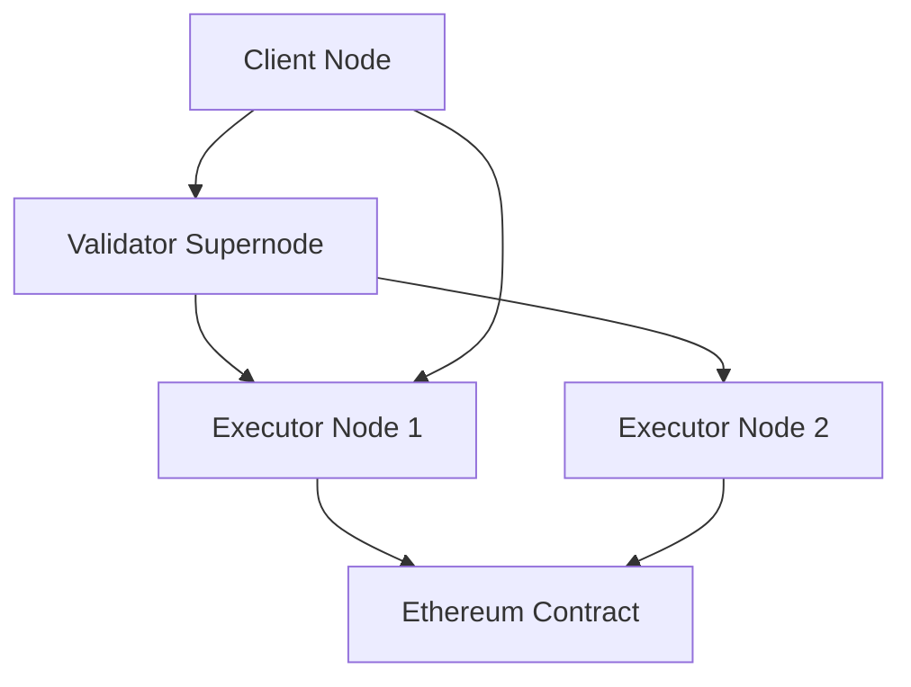

# Lloom - Decentralized P2P LLM Network

A decentralized peer-to-peer network for distributing Large Language Model (LLM) requests across a network of executor nodes, with blockchain-based accounting for usage tracking.

## Architecture

The Lloom network consists of three types of nodes:

- **Client**: Requests LLM services from the network
- **Executor**: Provides LLM services and processes requests
- **Validator**: Maintains network discovery and acts as a bootstrap supernode



## Features

- **Decentralized Discovery**: Uses Kademlia DHT for peer discovery
- **OpenAI-Compatible API**: Supports standard chat completion requests
- **Blockchain Accounting**: Records usage on Ethereum for transparency
- **Multi-Model Support**: Each executor can support different LLM backends
- **Fault Tolerance**: Automatic retry and failover mechanisms
- **Token Counting**: Accurate token usage tracking with tiktoken

## Quick Start

### Prerequisites

- Rust 1.70+ with Cargo
- Python 3.8+ (for mock server)
- Foundry (for smart contract deployment)
- OpenAI API key (or other LLM provider)

### Building

```bash
# Clone and build all components
git clone https://github.com/lloom/lloom
cd lloom
cargo build --release
```

### Running the Network

1. **Start the Mock LLM Server** (for testing):
```bash
python3 scripts/mock-llm-server.py --port 8080
```

2. **Deploy the Smart Contract** (optional):
```bash
# Set your private key
export PRIVATE_KEY="your_private_key_here"
./scripts/deploy.sh
```

3. **Start a Validator Node**:
```bash
./target/release/lloom-validator \
    --private-key-file validator-key.txt \
    --p2p-port 9000
```

4. **Start an Executor Node**:
```bash
# Copy and configure the executor
cp crates/lloom-executor/config.toml.example config.toml
# Edit config.toml with your settings

./target/release/lloom-executor \
    --private-key "your_executor_private_key" \
    --bootstrap-nodes "/ip4/127.0.0.1/tcp/9000" \
    --config config.toml \
    --openai-api-key "your_api_key_or_skip_for_mock"
```

5. **Run a Client Request**:
```bash
./target/release/lloom-client \
    --bootstrap-nodes "/ip4/127.0.0.1/tcp/9000" \
    --model "gpt-3.5-turbo" \
    --prompt "Hello, how are you today?"
```

## Configuration

### Executor Configuration

See [`crates/lloom-executor/config.toml.example`](crates/lloom-executor/config.toml.example) for a complete configuration example.

Key sections:
- `llm_backends`: Configure your LLM provider APIs
- `blockchain`: Ethereum RPC and contract settings
- `network`: P2P networking configuration

### Environment Variables

- `OPENAI_API_KEY`: Your OpenAI API key
- `LLOOM_PRIVATE_KEY`: Private key for node identity
- `SEPOLIA_RPC_URL`: Ethereum RPC endpoint
- `ACCOUNTING_CONTRACT`: Smart contract address

## Smart Contract

The accounting smart contract is deployed on Ethereum Sepolia testnet. It records:
- Token usage per executor and client
- Model usage statistics
- Network-wide metrics

Contract events can be indexed for analytics and billing purposes.

## Development

### Project Structure

```
lloom/
├── crates/
│   ├── lloom-core/     # Shared networking and protocol logic
│   ├── lloom-client/   # Client CLI application
│   ├── lloom-executor/ # Executor service node
│   └── lloom-validator/ # Discovery supernode
├── contracts/                 # Ethereum smart contracts
├── scripts/                   # Deployment and utility scripts
└── docs/                      # Additional documentation
```

### Running Tests

```bash
# Run unit tests
cargo test

# Run integration tests (requires running nodes)
cargo test --test integration_tests
```

### Mock Testing

For development and testing without API costs:

1. Use the mock LLM server: `python3 scripts/mock-llm-server.py`
2. Configure executor to use mock endpoint: `http://localhost:8080`
3. No API key required for mock server

## Contributing

1. Fork the repository
2. Create a feature branch
3. Add tests for new functionality
4. Ensure all tests pass
5. Submit a pull request

## License

This project is licensed under the MIT License - see the [LICENSE](LICENSE) file for details.

## Roadmap

- [ ] Support for more LLM providers (Anthropic, Cohere, etc.)
- [ ] Advanced load balancing and routing
- [ ] Reputation system for executors
- [ ] Streaming response support
- [ ] Web-based dashboard
- [ ] Multi-chain support (Polygon, Arbitrum)

## Support

- Issues: [GitHub Issues](https://github.com/lloom/lloom/issues)
- Discussions: [GitHub Discussions](https://github.com/lloom/lloom/discussions)
- Documentation: [Wiki](https://github.com/lloom/lloom/wiki)