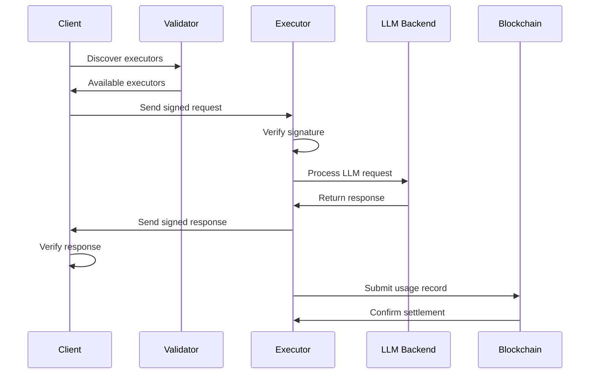

# Architecture

Lloom is designed as a decentralized, peer-to-peer network for Large Language Model (LLM) services. This chapter provides a comprehensive overview of the system architecture, component interactions, and design principles.

## System Overview

```
┌─────────────┐     ┌─────────────┐     ┌─────────────┐
│   Client    │     │  Executor   │     │  Validator  │
│             │     │             │     │             │
│ • Request   │     │ • Process   │     │ • Bootstrap │
│ • Verify    │     │ • Sign      │     │ • Discover  │
│ • Pay       │     │ • Execute   │     │ • Maintain  │
└──────┬──────┘     └──────┬──────┘     └──────┬──────┘
       │                   │                    │
       └───────────────────┴────────────────────┘
                           │
                    ┌──────┴──────┐
                    │  P2P Network │
                    │  (libp2p)    │
                    └──────┬──────┘
                           │
                    ┌──────┴──────┐
                    │  Blockchain  │
                    │  (Ethereum)  │
                    └─────────────┘
```

## Core Components

### 1. Client Nodes

Clients are the consumers of LLM services in the network:

**Responsibilities:**
- Generate cryptographically signed requests
- Discover available executors through the P2P network
- Select executors based on capabilities and pricing
- Verify response signatures and content
- Handle payment settlement

**Key Features:**
- Lightweight operation (no LLM models required)
- Direct peer-to-peer communication
- Request routing and retry logic
- Response validation

### 2. Executor Nodes

Executors provide LLM inference services to the network:

**Responsibilities:**
- Advertise available models and pricing
- Receive and validate client requests
- Execute LLM inference using configured backends
- Sign responses with usage information
- Submit accounting data to blockchain

**Key Features:**
- Multiple backend support (OpenAI, LMStudio, custom)
- Dynamic model discovery
- Resource management and rate limiting
- Granular token accounting

### 3. Validator Nodes

Validators maintain network integrity and facilitate discovery:

**Responsibilities:**
- Act as bootstrap nodes for new participants
- Maintain peer routing tables
- Facilitate service discovery
- Monitor network health
- Enforce protocol compliance

**Key Features:**
- High availability requirements
- Minimal resource usage
- Network topology management
- Peer reputation tracking

## Network Architecture

### P2P Communication Layer

Lloom uses libp2p for all network communication:

**Protocols:**
- **Kademlia DHT**: Distributed peer and service discovery
- **Gossipsub**: Broadcast announcements and updates
- **Request-Response**: Direct client-executor communication
- **Identify**: Peer identification and capability exchange

**Network Topology:**
```
        Validator (Bootstrap)
       /     |     \
      /      |      \
  Client  Executor  Client
    |        |        |
    +--------+--------+
         Direct P2P
```

### Message Flow

1. **Service Discovery**
   ```
   Client → Validator: "Find executors with model X"
   Validator → Client: "Executors A, B, C available"
   ```

2. **Request Processing**
   ```
   Client → Executor: SignedRequest{model, prompt, pricing}
   Executor → LLM Backend: Process inference
   Executor → Client: SignedResponse{content, usage, signature}
   ```

3. **Settlement**
   ```
   Executor → Blockchain: SubmitUsageRecord{client, usage, signatures}
   Blockchain → Executor: Confirmation
   ```

## Security Architecture

### Cryptographic Identity

Every node has a unique cryptographic identity:

```rust
pub struct Identity {
    pub keypair: Keypair,        // Ed25519 keypair for P2P
    pub peer_id: PeerId,         // Derived from public key
    pub wallet: PrivateKeySigner, // Ethereum wallet
    pub evm_address: Address,    // Ethereum address
}
```

**Identity Properties:**
- Deterministic PeerId generation from keypair
- Ethereum-compatible signatures
- Unified identity across P2P and blockchain

### Message Signing

All messages use EIP-712 structured data signing:

```rust
pub struct SignedMessage<T> {
    pub payload: T,
    pub signature: Signature,
    pub signer: Address,
    pub timestamp: u64,
    pub nonce: Option<u64>,
}
```

**Security Features:**
- Tamper-proof message authentication
- Replay attack protection
- Non-repudiation guarantees
- Time-based validity

## Data Flow Architecture

### Request Lifecycle



### State Management

Lloom nodes maintain minimal state:

**Client State:**
- Active requests
- Peer connections
- Response cache

**Executor State:**
- Model registry
- Request queue
- Usage records
- Backend connections

**Validator State:**
- Peer registry
- Network topology
- Service index

## Scalability Design

### Horizontal Scaling

The network scales through:

1. **Multiple Executors**: Add more executors for capacity
2. **Geographic Distribution**: Executors in different regions
3. **Model Specialization**: Executors can specialize in specific models
4. **Load Balancing**: Clients choose executors based on availability

### Performance Optimization

**Caching Strategies:**
- Response caching for repeated queries
- Model warmup in executors
- Connection pooling for backends

**Efficient Protocols:**
- Binary message encoding
- Compressed responses
- Multiplexed connections
- Concurrent request handling

## Blockchain Integration

### Smart Contract Architecture

```solidity
contract AccountingV2 {
    // Core state
    mapping(address => uint64) public clientNonces;
    mapping(address => ExecutorStats) public executorStats;
    mapping(address => ClientStats) public clientStats;
    
    // Settlement functions
    function processRequest(...) external;
    function verifySignatures(...) internal;
    function updateStatistics(...) internal;
}
```

### Settlement Model

**Off-chain Processing:**
- Request/response handled entirely P2P
- No blockchain interaction during inference
- Signatures ensure accountability

**On-chain Settlement:**
- Periodic batch submissions
- Aggregated usage records
- Dispute resolution mechanism

## Extensibility

### Plugin Architecture

Lloom supports extensibility through:

1. **Custom LLM Backends**: Implement the `LlmBackend` trait
2. **Alternative Blockchains**: Swap settlement layer
3. **Protocol Extensions**: Add new message types
4. **Monitoring Integrations**: Export custom metrics

### Backend Interface

```rust
#[async_trait]
pub trait LlmBackend: Send + Sync {
    async fn complete(&self, request: CompletionRequest) 
        -> Result<CompletionResponse>;
    
    async fn list_models(&self) -> Result<Vec<String>>;
    
    fn name(&self) -> &str;
}
```

## Design Principles

### 1. Decentralization First
- No central servers or coordinators
- Peer autonomy and direct communication
- Resilient to node failures

### 2. Security by Design
- Cryptographic verification at every step
- Zero-trust architecture
- Minimal attack surface

### 3. Economic Incentives
- Fair compensation for resources
- Market-driven pricing
- Transparent accounting

### 4. Developer Experience
- Simple, intuitive APIs
- Comprehensive documentation
- Minimal configuration

### 5. Performance
- Efficient protocols
- Minimal overhead
- Horizontal scalability

## Future Architecture Considerations

### Planned Enhancements

1. **Sharding**: Partition network for scalability
2. **Reputation System**: Track executor reliability
3. **Model Verification**: Prove model authenticity
4. **Privacy Features**: Encrypted prompts/responses
5. **Cross-chain Support**: Multiple blockchain settlements

### Research Areas

- Zero-knowledge proofs for privacy
- Decentralized model storage
- Federated learning integration
- Advanced load balancing algorithms

## Summary

The Lloom architecture provides a robust foundation for decentralized LLM services through:

- Clear separation of concerns between clients, executors, and validators
- Strong cryptographic guarantees for all interactions
- Efficient P2P protocols for discovery and communication
- Flexible blockchain integration for settlements
- Extensible design for future enhancements

This architecture enables a trustless, scalable, and efficient marketplace for AI services while maintaining security and decentralization principles.