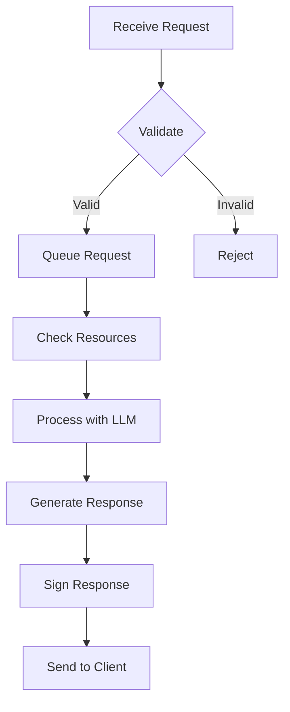

# Running an Executor

Executors are the backbone of the Lloom network, processing LLM requests from clients and earning rewards for their services. This guide covers everything you need to know about running an executor node.

## Overview

An executor node:
- Receives LLM requests from clients via P2P network
- Processes requests using configured LLM backends
- Signs responses with EIP-712 for accountability
- Earns fees based on token usage

## Quick Start

### Basic Setup

1. **Install the executor binary**:
   ```bash
   cargo install lloom-executor
   # Or download pre-built binary
   ```

2. **Create configuration**:
   ```bash
   lloom-executor init
   # Creates default config at ~/.lloom/executor/config.toml
   ```

3. **Configure LLM backend** (e.g., LMStudio):
   ```toml
   [llm_client]
   backend = "lmstudio"
   base_url = "http://localhost:1234/v1"
   ```

4. **Start the executor**:
   ```bash
   lloom-executor start
   ```

## Configuration

### Full Configuration Example

```toml
# Network configuration
[network]
listen_address = "/ip4/0.0.0.0/tcp/4001"
external_address = "/ip4/YOUR_PUBLIC_IP/tcp/4001"
bootstrap_peers = [
    "/ip4/bootstrap1.lloom.network/tcp/4001/p2p/12D3KooW...",
    "/ip4/bootstrap2.lloom.network/tcp/4001/p2p/12D3KooW..."
]

# P2P protocols
[network.protocols]
enable_mdns = true
enable_kad = true
enable_gossipsub = true
enable_autonat = true
enable_relay = true

# Identity
[identity]
private_key_path = "~/.lloom/executor/identity_key"
ethereum_private_key_path = "~/.lloom/executor/eth_key"

# LLM Backend Configuration
[llm_client]
backend = "lmstudio"  # Options: lmstudio, openai
base_url = "http://localhost:1234/v1"
api_key = "${LLM_API_KEY}"  # For OpenAI or authenticated endpoints
timeout_secs = 300
max_retries = 3

# Model configuration
[[models]]
name = "llama-2-13b-chat"
context_length = 4096
inbound_price = "0.00001"   # ETH per token
outbound_price = "0.00002"  # ETH per token
max_batch_size = 4

[[models]]
name = "mistral-7b-instruct"
context_length = 8192
inbound_price = "0.000008"
outbound_price = "0.000015"
max_batch_size = 8

# Request handling
[request_handling]
max_concurrent_requests = 10
request_timeout_secs = 600
max_request_size_bytes = 1048576  # 1MB
max_tokens_per_request = 4096

# Pricing strategy
[pricing]
strategy = "dynamic"  # Options: fixed, dynamic, market
base_multiplier = 1.0
peak_multiplier = 1.5
off_peak_multiplier = 0.8
update_interval_secs = 300

# Blockchain configuration
[blockchain]
enabled = false  # Set to true when using on-chain features
rpc_url = "http://localhost:8545"
chain_id = 1
contract_address = "0x..."
gas_price_gwei = 20

# Metrics and monitoring
[metrics]
enabled = true
endpoint = "0.0.0.0:9092"
push_gateway = "http://prometheus-pushgateway:9091"
push_interval_secs = 30

# Logging
[logging]
level = "info"  # Options: trace, debug, info, warn, error
file = "~/.lloom/executor/executor.log"
max_size_mb = 100
max_backups = 5
```

### Environment Variables

Key environment variables:

```bash
# Required for OpenAI backend
export OPENAI_API_KEY="sk-..."

# Optional overrides
export LLOOM_EXECUTOR_PORT="4001"
export LLOOM_EXECUTOR_MODELS="gpt-3.5-turbo,gpt-4"
export LLOOM_METRICS_ENABLED="true"
export RUST_LOG="lloom_executor=debug"
```

## LLM Backend Setup

### LMStudio Setup

1. **Install LMStudio**:
   - Download from [lmstudio.ai](https://lmstudio.ai)
   - Install and launch

2. **Download Models**:
   - Use LMStudio UI to download models
   - Recommended: Llama 2, Mistral, Mixtral

3. **Start Local Server**:
   - In LMStudio: Server → Start Server
   - Default port: 1234

4. **Verify Connection**:
   ```bash
   curl http://localhost:1234/v1/models
   ```

5. **Configure Executor**:
   ```toml
   [llm_client]
   backend = "lmstudio"
   base_url = "http://localhost:1234/v1"
   ```

### OpenAI Setup

1. **Get API Key**:
   - Sign up at [platform.openai.com](https://platform.openai.com)
   - Generate API key

2. **Configure**:
   ```toml
   [llm_client]
   backend = "openai"
   base_url = "https://api.openai.com/v1"
   api_key = "${OPENAI_API_KEY}"
   ```

3. **Set Usage Limits**:
   ```toml
   [openai_limits]
   max_requests_per_minute = 60
   max_tokens_per_minute = 150000
   max_cost_per_day_usd = 100
   ```

### Custom Backend Integration

Implement the LLM backend trait:

```rust
use lloom_executor::LlmBackend;

pub struct CustomBackend {
    // Your implementation
}

#[async_trait]
impl LlmBackend for CustomBackend {
    async fn complete(&self, request: LlmRequest) -> Result<LlmResponse> {
        // Your completion logic
    }
    
    async fn list_models(&self) -> Result<Vec<Model>> {
        // Return available models
    }
}
```

## Model Management

### Auto-Discovery

Enable automatic model discovery:

```toml
[model_discovery]
enabled = true
refresh_interval_secs = 300
advertise_models = true
```

The executor will:
1. Query backend for available models
2. Advertise models to network
3. Update pricing dynamically

### Manual Model Configuration

Define models explicitly:

```toml
[[models]]
name = "llama-2-70b-chat"
enabled = true
context_length = 4096
max_batch_size = 2

# Pricing
inbound_price = "0.00002"   # ETH per token
outbound_price = "0.00004"  # ETH per token

# Performance limits
max_tokens_per_second = 50
max_concurrent_requests = 5

# Resource allocation
gpu_memory_gb = 40
cpu_cores = 8
```

### Model Aliasing

Create user-friendly aliases:

```toml
[model_aliases]
"fast" = "llama-2-7b-chat"
"balanced" = "llama-2-13b-chat"
"quality" = "llama-2-70b-chat"
"code" = "codellama-13b-instruct"
```

## Request Processing

### Request Validation

The executor validates all requests:

1. **Signature Verification**: EIP-712 signature from client
2. **Model Availability**: Requested model is available
3. **Token Limits**: Within configured limits
4. **Content Filtering**: Optional content moderation

### Request Lifecycle



### Batching Requests

Enable request batching for efficiency:

```toml
[batching]
enabled = true
max_batch_size = 8
batch_timeout_ms = 100
group_by_model = true
```

### Priority Handling

Configure request priorities:

```toml
[priority]
enabled = true
high_priority_price_multiplier = 1.5
queue_sizes = { low = 100, normal = 200, high = 50 }
```

## Performance Optimization

### Resource Management

Configure resource limits:

```toml
[resources]
max_memory_gb = 32
max_cpu_percent = 80
gpu_memory_reserved_gb = 2
swap_enabled = false

[resources.per_model]
"llama-2-70b" = { memory_gb = 40, gpu_required = true }
"llama-2-13b" = { memory_gb = 16, gpu_required = true }
"llama-2-7b" = { memory_gb = 8, gpu_required = false }
```

### Caching

Enable response caching:

```toml
[cache]
enabled = true
backend = "redis"  # Options: memory, redis, disk
max_size_gb = 10
ttl_seconds = 3600

[cache.redis]
url = "redis://localhost:6379"
prefix = "lloom:cache:"
```

### Load Balancing

For multiple GPUs:

```toml
[gpu_allocation]
strategy = "round_robin"  # Options: round_robin, least_loaded, affinity
devices = [0, 1, 2, 3]

[[gpu_allocation.model_affinity]]
model = "llama-2-70b"
devices = [0, 1]  # Use first two GPUs

[[gpu_allocation.model_affinity]]
model = "llama-2-13b"
devices = [2, 3]  # Use last two GPUs
```

## Monitoring

### Prometheus Metrics

Available metrics at `http://localhost:9092/metrics`:

```prometheus
# Request metrics
lloom_executor_requests_total{model="llama-2-13b",status="success"} 1523
lloom_executor_request_duration_seconds{model="llama-2-13b",quantile="0.99"} 3.2
lloom_executor_queue_size{priority="normal"} 5

# Token metrics
lloom_executor_tokens_processed_total{model="llama-2-13b",type="inbound"} 523456
lloom_executor_tokens_per_second{model="llama-2-13b"} 45.3

# Revenue metrics
lloom_executor_revenue_total{currency="ETH"} 0.534
lloom_executor_revenue_per_request{model="llama-2-13b"} 0.00035

# Resource metrics
lloom_executor_gpu_utilization_percent{device="0"} 87.5
lloom_executor_memory_usage_bytes 28547395584
lloom_executor_model_load_time_seconds{model="llama-2-13b"} 45.2
```

### Grafana Dashboard

Import the provided dashboard:

1. Access Grafana at `http://localhost:3000`
2. Import dashboard from `/dashboards/executor.json`
3. Select Prometheus data source

### Health Checks

Built-in health endpoints:

```bash
# Basic health check
curl http://localhost:8080/health

# Detailed status
curl http://localhost:8080/health/detailed
```

Response:
```json
{
  "status": "healthy",
  "uptime_seconds": 3600,
  "models_loaded": ["llama-2-13b", "mistral-7b"],
  "active_requests": 3,
  "total_requests": 1523,
  "backend_status": "connected",
  "p2p_peers": 45
}
```

## Security

### Authentication

Protect administrative endpoints:

```toml
[api]
enabled = true
listen_address = "127.0.0.1:8080"
auth_token = "${EXECUTOR_API_TOKEN}"
tls_cert = "/path/to/cert.pem"
tls_key = "/path/to/key.pem"
```

### Request Filtering

Enable content filtering:

```toml
[content_filter]
enabled = true
block_patterns = [
    "malicious.*pattern",
    "dangerous.*content"
]
max_prompt_length = 10000
scan_responses = true
```

### Rate Limiting

Protect against abuse:

```toml
[rate_limiting]
enabled = true

[[rate_limiting.rules]]
identifier = "peer_id"
max_requests_per_minute = 60
max_tokens_per_minute = 100000

[[rate_limiting.rules]]
identifier = "ip_address"
max_requests_per_minute = 100
burst_size = 20
```

## High Availability

### Clustering

Run multiple executors:

```toml
[clustering]
enabled = true
node_id = "executor-1"
peers = [
    "executor-2.internal:7000",
    "executor-3.internal:7000"
]
consensus = "raft"
shared_state_backend = "redis"
```

### Backup Configuration

Enable backup executor:

```toml
[failover]
enabled = true
role = "primary"  # or "backup"
health_check_interval_secs = 10
takeover_delay_secs = 30
vip_address = "192.168.1.100"
```

## Troubleshooting

### Common Issues

1. **Model Loading Failures**
   ```
   Error: Failed to load model 'llama-2-70b'
   Cause: Insufficient GPU memory
   
   Solution:
   - Check GPU memory with nvidia-smi
   - Reduce max_batch_size
   - Use quantized model version
   ```

2. **Network Connectivity**
   ```
   Error: Failed to connect to bootstrap peers
   
   Solution:
   - Check firewall rules (port 4001)
   - Verify external_address is correct
   - Try alternative bootstrap peers
   ```

3. **LLM Backend Timeout**
   ```
   Error: Request to LLM backend timed out
   
   Solution:
   - Increase timeout_secs in config
   - Check backend is running
   - Monitor backend resource usage
   ```

### Debug Mode

Enable comprehensive debugging:

```bash
RUST_LOG=lloom_executor=trace lloom-executor start --debug
```

Debug output includes:
- P2P protocol messages
- Request/response details
- Model loading process
- Resource allocation decisions

### Diagnostic Commands

```bash
# Check configuration
lloom-executor config validate

# Test LLM backend connection
lloom-executor test-backend

# List loaded models
lloom-executor models list

# Show peer connections
lloom-executor peers list

# Benchmark model performance
lloom-executor benchmark --model llama-2-13b
```

## Maintenance

### Log Rotation

Configure log management:

```toml
[logging]
file = "/var/log/lloom/executor.log"
max_size_mb = 100
max_backups = 5
compress = true
```

### Database Maintenance

Clean up old data:

```bash
# Clean cache older than 7 days
lloom-executor maintenance clean-cache --older-than 7d

# Optimize database
lloom-executor maintenance optimize-db

# Backup configuration and state
lloom-executor maintenance backup --output /backup/executor-backup.tar.gz
```

### Updates

Update executor safely:

```bash
# Check for updates
lloom-executor update check

# Download update
lloom-executor update download

# Apply update (with automatic rollback on failure)
lloom-executor update apply --backup
```

## Advanced Features

### Custom Plugins

Load executor plugins:

```toml
[[plugins]]
name = "custom-filter"
path = "/usr/lib/lloom/plugins/filter.so"
config = { threshold = 0.9 }

[[plugins]]
name = "performance-monitor"
path = "/usr/lib/lloom/plugins/monitor.so"
```

### Webhook Integration

Send events to external systems:

```toml
[webhooks]
enabled = true

[[webhooks.endpoints]]
url = "https://monitoring.example.com/webhook"
events = ["request_completed", "error", "model_loaded"]
auth_header = "Bearer ${WEBHOOK_TOKEN}"
retry_attempts = 3
```

### Custom Metrics

Export additional metrics:

```rust
use lloom_executor::metrics::{register_histogram, register_counter};

// Register custom metrics
let custom_latency = register_histogram!(
    "custom_processing_latency",
    "Custom processing step latency"
);

let custom_counter = register_counter!(
    "custom_events_total",
    "Total custom events"
);
```

## Best Practices

1. **Resource Planning**
   - Monitor resource usage regularly
   - Plan for peak loads
   - Keep 20% headroom

2. **Security**
   - Rotate keys regularly
   - Use firewall rules
   - Monitor for anomalies

3. **Performance**
   - Tune batch sizes
   - Enable caching
   - Use appropriate models

4. **Reliability**
   - Set up monitoring alerts
   - Configure automatic restarts
   - Regular backups

5. **Network**
   - Use stable network connection
   - Configure proper NAT traversal
   - Monitor peer connections